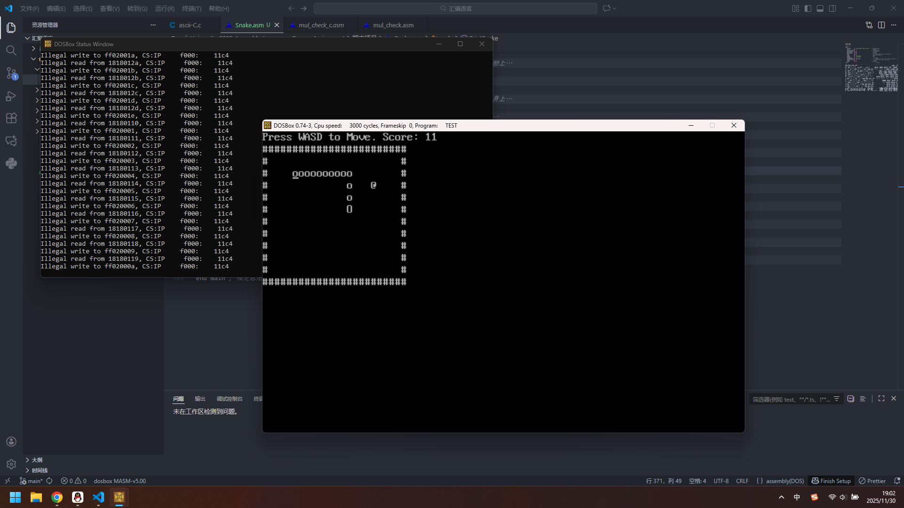
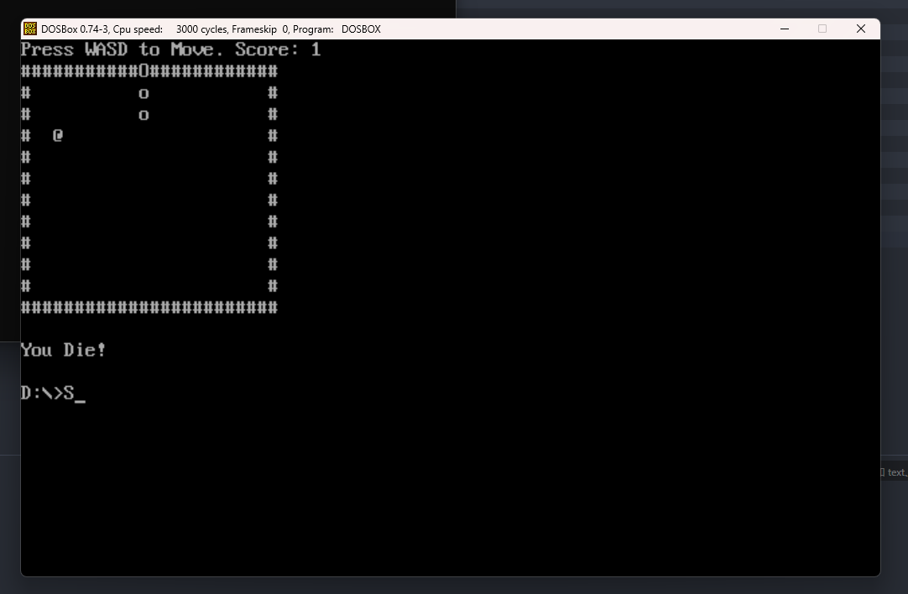

# 贪吃蛇游戏 - 汇编语言项目开发文档

## 项目名称

**汇编语言贪吃蛇游戏 (Assembly Snake Game)**

## 项目介绍

这是一个使用 x86 汇编语言开发的经典贪吃蛇游戏，运行在 DOS 环境下。游戏通过键盘控制蛇的移动，吃掉随机生成的食物来增长身体和得分。



## 功能特性

### 核心功能

- **游戏控制**：使用 WASD 键控制蛇的移动方向
- **食物系统**：随机生成食物，避免出现在蛇身上
- **碰撞检测**：检测与边界和自身身体的碰撞
- **分数系统**：实时显示得分，吃到食物得分增加
- **游戏状态**：胜利条件（218 分）和失败条件的判定

### 游戏机制

- **初始设置**：蛇长度为 2，位于地图中央
- **移动规则**：蛇头移动，身体跟随，不能反向移动
- **增长机制**：吃到食物后长度+1，分数+1
- **边界限制**：24×12 的游戏区域，撞墙游戏结束
- **自撞检测**：从第 5 段身体开始检测自撞

## 技术架构

### 数据段设计

```asm
.data
    ScoreMsg       db  'Press WASD to Move. Score: $'
    Score          dw  0
    BorderTopLeftX dw  0
    BorderTopLeftY dw  1
    BorderWidth    equ 24
    BorderHeight   equ 12
    IfDie          dw  0
    IfWin          dw  0
    DieMsg         db  'You Die!$'
    WinMsg         db  'You Win!$'
    SnakeLength    dw  2
    SnakePositions dw  440 dup(0)    ; 蛇身位置数组
    SnakeDirection dw  0             ; 移动方向
    FoodX          dw  0             ; 食物坐标
    FoodY          dw  0
```

### 主要函数模块

1. **主控制模块**

   - **main** - 游戏主循环
   - **GameLoop** - 游戏逻辑循环
   - **GameOver/Win** - 游戏结束处理

2. **输入处理模块**

   - **CheckKeyboardInput** - 键盘输入检测和方向控制

3. **游戏逻辑模块**

   - **UpdateSnakePosition** - 更新蛇的位置
   - **CheckFoodCollision** - 食物碰撞检测
   - **CheckGameStatus** - 游戏状态检查

4. **图形显示模块**

   - **PrintSnake** - 绘制蛇身
   - **PrintBorder** - 绘制游戏边框
   - **PrintScore** - 显示分数
   - **GenerateFood** - 生成和显示食物

5. **工具函数模块**
   - **ClearConsole** - 清空屏幕
   - **DelayOneSecond** - 延时控制
   - **InitializeSnakePositions** - 初始化游戏

## 开发流程

### 第一阶段：基础框架搭建

1. 建立项目基本结构，定义数据段和代码段
2. 实现基本的屏幕清空和光标控制
3. 创建游戏主循环框架

### 第二阶段：核心游戏逻辑

1. 实现蛇的移动算法和位置更新
2. 开发键盘输入处理系统
3. 添加碰撞检测机制

### 第三阶段：游戏功能完善

1. 实现食物生成和碰撞检测
2. 添加分数系统和游戏状态判断
3. 优化随机数生成算法

### 第四阶段：用户体验优化

1. 改进图形显示效果
2. 添加游戏结束提示
3. 优化游戏节奏和控制响应

## 技术难点与解决方案

### 1. 蛇身移动算法

**问题**：如何高效更新蛇的每一段位置
**解决方案**：采用从尾部向前逐段复制位置的方法，避免复杂的链表操作

### 2. 随机食物生成

**问题**：确保食物不生成在蛇身上
**解决方案**：使用系统计时器作为随机种子，配合碰撞检测循环生成

### 3. 键盘输入响应

**问题**：实时响应键盘输入且防止缓冲区溢出
**解决方案**：使用 BIOS 中断检测按键，配合缓冲区清空机制

### 4. 碰撞检测优化

**问题**：自撞检测的性能优化
**解决方案**：从第 5 段身体开始检测，减少不必要的比较操作

## 项目特色

### 代码优化

- 使用数据段初始化简化数组清零操作
- 采用高效的寄存器操作减少内存访问
- 合理的函数模块划分提高代码可维护性

### 用户体验

- 清晰的游戏界面和状态显示
- 流畅的控制响应和游戏节奏
- 明确的游戏规则和胜利条件

## 开发心得

### 技术收获

1. **深入理解汇编语言**：通过实际项目加深了对 x86 汇编指令、寄存器操作、内存管理的理解
2. **掌握 BIOS/DOS 中断**：熟练运用视频中断、键盘中断、延时中断等系统功能
3. **算法优化能力**：在资源受限环境下设计高效算法的能力得到提升

### 工程实践

1. **模块化设计**：将复杂功能分解为独立函数，提高代码可读性和可维护性
2. **调试技巧**：掌握在汇编级别调试程序的方法，能够快速定位和解决问题
3. **性能考量**：在代码编写过程中始终考虑执行效率和内存使用

### 项目感悟

这个项目让我深刻体会到低级语言编程的挑战和乐趣。虽然汇编语言开发效率较低，但能够完全控制硬件资源，实现极致的性能优化。通过这个项目，不仅提升了编程技能，更培养了对计算机系统底层工作原理的深入理解。

## 运行环境

- **操作系统**：DOS 或 DOS 兼容环境
- **汇编器**：MASM 6.11 或兼容版本
- **运行方式**：编译后生成可执行文件在 DOS 下运行

## 未来改进方向

1. 添加游戏难度选择
2. 实现高分记录功能
3. 增加游戏暂停功能
4. 优化图形显示效果
5. 添加音效支持

## 项目总结

这个汇编语言贪吃蛇项目不仅是一个完整的游戏实现，更是对计算机系统底层原理的深入探索。通过亲手实现从输入处理到图形显示的每一个细节，对计算机工作原理有了更加深刻的理解。
